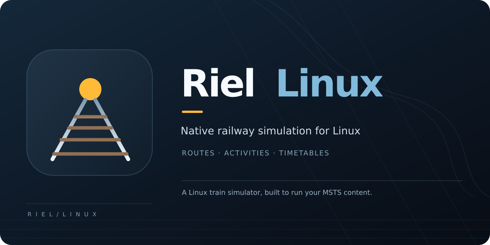
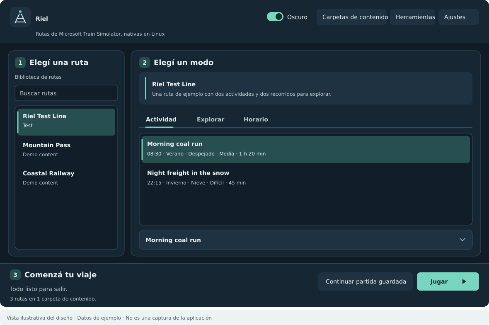

<p align="center"></p>

# Riel Linux

**Drive Microsoft Train Simulator routes natively on Linux.**

*Riel* is Spanish for the rail a train runs on. The simulator, launcher, packaging and releases
are developed here as a Linux project.

MSTS content under Wine is a frustrating experience: custom routes fail to load, performance is
poor, and every problem has two possible causes. Riel is a train simulator built as a Linux
program — no Wine, no Direct3D, no Windows Forms — so the failures that are Wine's fault simply
do not happen, and the ones that remain have one place to look.

It reads what Microsoft Train Simulator wrote: routes, activities, paths, consists, rolling
stock, cab views, sounds and the rest, from the folders they already live in.

## Why it exists

Copy a hand-built route onto a Linux machine and, under Wine, it often does not load at all. The
cause is dull and specific: MSTS content refers to its own files with whatever capitalisation the
author typed, because NTFS never cared. ext4 does. A single `TEXTURES\Rail.ace` that the shape
file spells `Textures\RAIL.ACE` is enough to lose a route.

Riel resolves every content path case insensitively — one lookup layer, in front of the readers
the whole engine goes through — so a route copied off a Windows machine loads as it was authored.
That is the change the rest of this project was built around.

## What is here

- **Native throughout.** .NET 10 on `linux-x64`, MonoGame's OpenGL backend, SDL for the window
  and the displays, the distribution's OpenAL for sound.
- **Text without GDI+.** .NET has no `System.Drawing` on Unix, and the engine rasterises every
  label, cab dial and head-up display with it. A compatibility layer over SkiaSharp keeps that
  code unchanged rather than rewriting it.
- **No registry, no Win32.** Memory and process counters come from `/proc`, MSTS installations
  are found by searching the usual places and any Wine or Proton prefix, and the RailDriver desk
  is driven through the kernel's hidraw interface.
- **Files where they belong.** Settings, saves, logs and content indexes follow the XDG base
  directory specification instead of one folder holding all four.
- **A launcher to pick and play.** Choose a route and an activity, explore with a path and train,
  or select a timetable service. Suggested times include departures from the route's activities;
  the information panel shows the selected path, locomotive and vehicles. It has content folders,
  settings, saved games, activity checks, update checks and diagnostics under **Tools**. It
  follows the system language and supports Spanish; dark mode can be switched off. Terminal
  commands are available as `riel`.
- **Failures say why.** When a run fails, the launcher shows the cause in a sentence - the file
  that is missing, the route that could not be read - rather than a click that seems to do
  nothing. A content folder with a broken route still loads everything else, and names what it
  could not read and why, down to the line.
- **Packaged for Arch**, with a PKGBUILD ready for the AUR.

## Getting started

```sh
git clone https://github.com/agustinluzardo/Riel-Linux.git
cd Riel-Linux/packaging/arch
makepkg -si                               # or build by hand: docs/linux/INSTALL.md
```

Then open **Riel** from the applications menu, choose the folder that holds `ROUTES` and
`GLOBAL`, pick a route and press Play.



This illustration follows the current launcher layout and uses the synthetic test route included
in this repository. Your routes and activities appear in its place after you add a content folder.

From a terminal the same is:

```sh
riel content add "MSTS" /mnt/datos/games/MSTS   # or wherever the ROUTES/GLOBAL folder lives
riel routes
riel play "Marias Pass" "Coal Train"
```

**Tools → Check this computer** in the launcher, or `riel doctor`, says whether this machine can run the
simulator and names what is missing. [**INSTALL.md**](docs/linux/INSTALL.md) covers installation
and what to do when something does not work.

To trace AI trains that remain stopped or move unusually slowly, use Settings → Advanced →
Train and signal traces, or launch Riel from a terminal:

```sh
RIEL_TRACE_AI_STOPS=1 RIEL_TRACE_AI_PROGRESS=1 riel
```

Run the affected activity in the launcher and inspect `~/.local/state/riel/Logs` for
`[AiStop]` and `[AiProgress]`. Stop records include the station's scheduled and actual
departure times and the next signal aspect. Progress records sample moving trains every
120 simulated seconds, including their speed, throttle, brakes and position.


## Dispatcher

Open the dispatcher from the running simulator. The map always identifies your train by number,
locomotive model and service. Click a train to inspect its live speed, control mode, direction,
consist and next scheduled station, or click **Centrar en el tren** to follow its location.
Stations and sidings show their names as you zoom in; click a station for platform details. Click a signal to inspect its aspect and choose automatic control, stop,
approach, proceed or call-on (where supported). Click a junction to request the main
or side route. The simulator rejects changes to occupied or reserved switches.
Use the mouse wheel or **+ / −** to zoom around the pointer, drag to pan and
**Centrar mapa** to fit the whole route. Labels appear progressively as you zoom
in to avoid covering the tracks; close zoom also shows signal aspects and junction numbers.

Dispatcher controls operate only from the local machine and are disabled in multiplayer.
The window uses the Riel icon in Xwayland.

## Status

Riel Linux runs MSTS routes and activities natively on Linux. Real route content is still being
tested, and compatibility varies by activity. If an activity fails, the logs in
`~/.local/state/riel/Logs` help identify the cause.

The public .NET assemblies and namespaces are `Riel.*`. Older rolling-stock DLLs built against
`FreeTrainSimulator.*` must be rebuilt against Riel, and C# route scripts using those namespaces
must update their imports. Back up older saves before updating if they were made with a build
that used the previous assembly names.

Known gaps:

- The WPF Toolbox and TrackViewer are Windows only and are not part of this build.
- Multiplayer builds but is untested here, and the launcher does not offer it yet.
- Some routes have AI traffic, signal and level-crossing behavior that differs from Open Rails;
  these are active compatibility investigations.
- The renderer is OpenGL. [ARCHITECTURE.md](docs/linux/ARCHITECTURE.md) explains why, and what a
  Vulkan backend would actually take; `RIEL_VULKAN=1` runs the same renderer on Vulkan through
  Mesa's zink in the meantime.

## Credits and code history

Riel Linux is developed and distributed independently. Its code descends from
[Free Train Simulator][fts] and [Open Rails][or], whose contributors built much of the original
simulation, formats, physics and timetables. Riel's Linux integration, launcher, packaging and
ongoing simulation and compatibility fixes are developed in this repository. Neither of those
projects needs to be installed to run Riel Linux.

We retain the original copyright notices and GPL terms. Open Rails remains a useful behavior
reference when testing MSTS content; Riel Linux owns its fixes and release decisions.
[ARCHITECTURE.md](docs/linux/ARCHITECTURE.md) documents the history and integration details;
the upstream README is kept at [docs/UPSTREAM-README.md](docs/UPSTREAM-README.md).

[fts]: https://github.com/perpetualKid/FreeTrainSimulator
[or]: https://github.com/openrails/openrails

## Licence

GPL-3.0-or-later. See [LICENSE](LICENSE) and the credits above.
